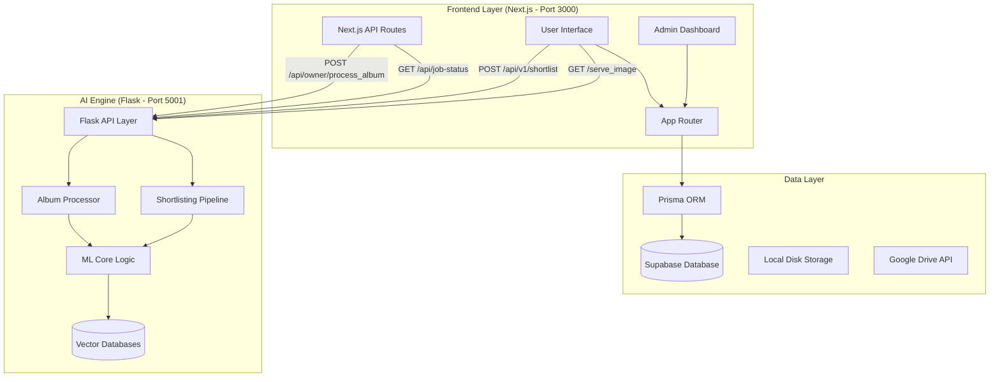

# 📸 SS Photo & Films: Comprehensive Project Architecture & Flow Report

This document serves as the master technical reference for the **SS Photo & Films** project. It details the end-to-end flow of data, the logic behind the Machine Learning engine, and the interconnectivity between the Next.js frontend and the AI backend.

---

## 🏛️ 1. High-Level System Architecture

The project is architected as a distributed system to handle heavy ML workloads while maintaining a responsive web interface.

---

## 🏗️ 2. Core Project Sections (Frontend)

### 📁 Application Routes (`/app`)

| Route | Description | API Connections |
| :--- | :--- | :--- |
| `/` | **Landing Page**: Branding and core service introduction. | - |
| `/admin` | **Admin Hub**: Overview of bookings and event status. | `/api/admin/events` |
| `/admin/bookings` | **Booking Management**: Accept/Reject client inquiries. | `/api/admin/bookings` |
| `/attendee/register` | **Guest Onboarding**: Collects guest details before photo search. | `Supabase Auth` |
| `/attendee/my-photos` | **Personal Gallery**: The AI-matched photo results page. | `/api/v1/shortlist` |
| `/booking` | **Client Inquiry Form**: Multi-step form for service booking. | `Next.js Server Actions` |
| `/gallery` | **Public Portfolio**: Showcases previous work. | - |
| `/checkout` | **Payment Page**: Handles Razorpay integration. | `/api/razorpay/*` |

---

## 🧠 3. Machine Learning & Preprocessing Deep Dive

The `face_recognition_engine` uses a sophisticated pipeline to ensure high accuracy even in crowded group photos.

### 🔍 A. Preprocessing Logic (`ml_core.py`)
Before any face is analyzed, every image undergoes:
1.  **EXIF Orientation Fix**: Ensures photos from professional cameras are rotated correctly.
2.  **Adaptive Resizing**: Scales images to **2048px** (LANCZOS) for the best balance of speed and detail.
3.  **CLAHE Enhancement**: Applies *Contrast Limited Adaptive Histogram Equalization* via OpenCV to normalize lighting and highlight facial features like eyes and jawlines.
4.  **Multi-Stage Detection**:
    *   **Level 1**: Fast scan (upsample=1).
    *   **Level 2**: Deep scan (upsample=2) if no faces are found, specifically targeting background guests.

### 🔢 B. Embedding Generation
*   **Vector Engine**: Dlib-based ResNet-34.
*   **Precision**: Uses `num_jitters=5` to average 5 slightly different versions of the same face, reducing noise in the 128D embedding.
*   **Data Integrity**: Skips "phantom faces" (detections smaller than 8x8 pixels) to prevent false positives.

### ⚡ C. The "Selfie Mirror" Solution
When a user uploads a selfie:
1.  **Original Vector**: Extracted from the uploaded selfie.
2.  **Flipped Vector**: Extracted from a horizontally flipped version of the selfie.
3.  **Comparison**: The engine compares *both* vectors against the database. This ensures that mirrored front-camera selfies still match perfectly with professional event photos.

---

## 📡 4. API Logic & Connectivity Detail

### 🌐 Next.js API Routes (`/app/api`)

#### 🛠️ Admin APIs
*   **`/api/admin/process-event`**: 
    *   **Trigger**: Admin clicks "Start AI Scan".
    *   **Logic**: Proxies form data (Drive link or ZIP) to the Flask engine. Immediately marks event as "Processing" in Supabase.
*   **`/api/admin/ai-progress`**:
    *   **Logic**: A webhook endpoint that receives real-time counters (e.g., "50/200 photos processed") from the Flask engine and updates the Admin UI.

#### 💳 Payment APIs (Razorpay)
*   **`/api/razorpay/order`**: Generates a secure `order_id` from the Razorpay servers.
*   **`/api/razorpay/verify`**: Validates the SHA-256 signature from Razorpay. On success, updates the booking status to `PAID` and triggers a confirmation email.

---

### 🐍 Python AI APIs (Port 5001)

| Endpoint | Method | Detailed Logic |
| :--- | :--- | :--- |
| `/api/owner/process_album` | `POST` | 1. Downloads Drive/Zip -> 2. Extracts -> 3. Spawns `ProcessPoolExecutor` -> 4. Updates DB CSV. |
| `/api/v1/shortlist` | `POST` | 1. Receives selfie -> 2. Generates two 128D vectors -> 3. Euclidean Distance calculation against CSV -> 4. Returns filenames. |
| `/api/job-status/<id>` | `GET` | Returns live counters for the specific background thread. |
| `/serve_image/<id>/<path>` | `GET` | Optimized image server with 3-stage fallback (Exact match -> Basename match -> Deep recursive search). |

---

## 🧹 5. Cleanup & Maintenance Report

The following optimizations have been applied to keep the project clean:
*   **Removed Scratch Scripts**: All `test-*.js`, `tmp-*.tsx`, and manual cleanup scripts deleted.
*   **Purged Caches**: `__pycache__`, `.pyc`, and `.next` build folders cleared.
*   **Large File Management**: Large temporary ZIPs in `user_uploads` identified for manual review.

---

## 🚀 6. How the Route is Connected (Visual Summary)

1.  **Guest** lands on `/attendee/register`.
2.  **Guest** uploads selfie; browser sends request to **`/api/v1/shortlist`** (Flask).
3.  **Flask** returns a list of matched filenames.
4.  **Frontend** renders `/attendee/my-photos` and fetches images via **`/serve_image/...`** (Flask).
5.  **Admin** monitors this via the `/admin` dashboard, which polls **`/api/job-status`**.

---
> **Report generated by Antigravity AI**
