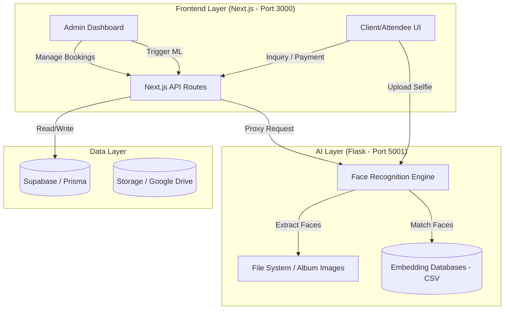

# 📸 SS Photo & Films: Project Architecture & Flow Report

This report provides a comprehensive overview of the entire system, detailing the interactions between the Next.js frontend, the Python AI Engine, and the underlying database.

---

## 🏛️ 1. High-Level System Architecture

The project is split into two primary layers: a **Full-Stack Web Application** (Next.js) and a **Machine Learning Engine** (Flask).

---

## 🏗️ 2. Core Project Sections

### 💎 A. Client/Booking Workflow
The primary business logic for the SS Photo & Films service.
1.  **Discovery**: Users browse services (Wedding, Pre-Wedding, Event).
2.  **Inquiry**: Users fill a booking form.
3.  **Admin Review**: Admin receives inquiries and can **Accept** or **Reject** with reasons.
4.  **Payment**: Integrated with **Razorpay**. Once accepted, clients pay a booking amount.
5.  **Confirmation**: Automated emails and dashboard updates post-payment.

### 🎭 B. Attendee/Guest Workflow
The AI-driven part of the project where guests find their photos.
1.  **Onboarding**: Guests visit via a link or QR code at an event.
2.  **Registration**: Quick profile creation.
3.  **Selfie Upload**: Guest uploads a clear selfie.
4.  **Instant Matching**: The AI engine compares the selfie against thousands of event photos.
5.  **Gallery**: Guest sees a personalized gallery containing only their photos.

### ⚙️ C. Admin Management
1.  **Dashboard**: Overview of analytics, pending inquiries, and active events.
2.  **Event Creation**: Link events to Google Drive folders or upload ZIP archives.
3.  **AI Orchestration**: Trigger the "Face Scan" process and monitor progress in real-time via webhooks.

---

## 🧠 3. Machine Learning & Preprocessing Flow

The `face_recognition_engine` is the heart of the automated shortlisting system.

### 🔍 Step 1: Preprocessing Pipeline
To handle complex event lighting and large group shots:
*   **EXIF Correction**: Automatic rotation based on camera metadata.
*   **CLAHE Enhancement**: Improves contrast around facial features for sharper 128D vectors.
*   **Upsampling**: Multi-stage detection (upsample=1 to upsample=2) to find small faces in the background.

### 🔢 Step 2: Embedding Generation
*   Uses **Dlib-based ResNet-34** to generate a 128-dimensional vector for every face.
*   **Parallel Processing**: Uses CPU multi-threading (N-1 cores) to process large albums quickly.
*   **Storage**: Embeddings are stored in event-specific CSV files for fast Euclidean distance lookup.

### ⚡ Step 3: Match Logic (The "Selfie Mirror")
*   **Mirror Handling**: Every user selfie is matched twice (original and horizontally flipped) to handle mirrored front-camera shots.
*   **Euclidean Distance**: Matches are determined by a distance threshold (default: 0.40).

---

## 📡 4. API Reference & Route Connectivity

### 🌐 Next.js APIs (`/app/api`)
| Route | Method | Purpose |
| :--- | :--- | :--- |
| `/api/admin/process-event` | `POST` | Proxies request to Python engine to start album scanning. |
| `/api/admin/ai-progress` | `GET` | Fetches real-time scanning status for the admin UI. |
| `/api/razorpay/order` | `POST` | Creates a new payment order. |
| `/api/razorpay/verify` | `POST` | Verifies payment signature and updates booking status. |
| `/api/auth/login` | `POST` | Handles admin/user authentication. |

### 🐍 Python Engine APIs (Port 5001)
| Route | Method | Purpose |
| :--- | :--- | :--- |
| `/api/owner/process_album` | `POST` | Downloads/Extracts images and builds the embedding database. |
| `/api/v1/shortlist` | `POST` | Compares a user selfie against an event database. |
| `/api/job-status/<id>` | `GET` | Returns JSON status of a running background job. |
| `/serve_image/<id>/<path>` | `GET` | Serves event photos with optimized caching. |

---

## 🧹 5. Project Cleanup Report

The project has been cleaned of temporary files and development artifacts:

**Deleted Files/Folders:**
*   `check-db.js` & `test-email.js` (Scratch scripts)
*   `tmp_app_page.tsx` & `tmp_mockData.ts` (Mock data)
*   `tsc_output.txt` & `tsconfig.tsbuildinfo` (Build artifacts)
*   `scratch/` directory (Prisma test scripts)
*   `tmp/` directory (UI fix scripts and old backups)

> [!WARNING]
> **Large File Alert**: A 5.7GB ZIP file was found in `face_recognition_engine/user_uploads`. It has NOT been deleted as it may contain event data, but should be reviewed.

---

## 🚀 6. Future Roadmap
*   **S3 Integration**: Moving from local storage to AWS S3 for better scalability.
*   **GPU Acceleration**: Porting `face_recognition` to CUDA for 10x faster processing.
*   **WhatsApp Bot**: Direct photo delivery via WhatsApp API.
