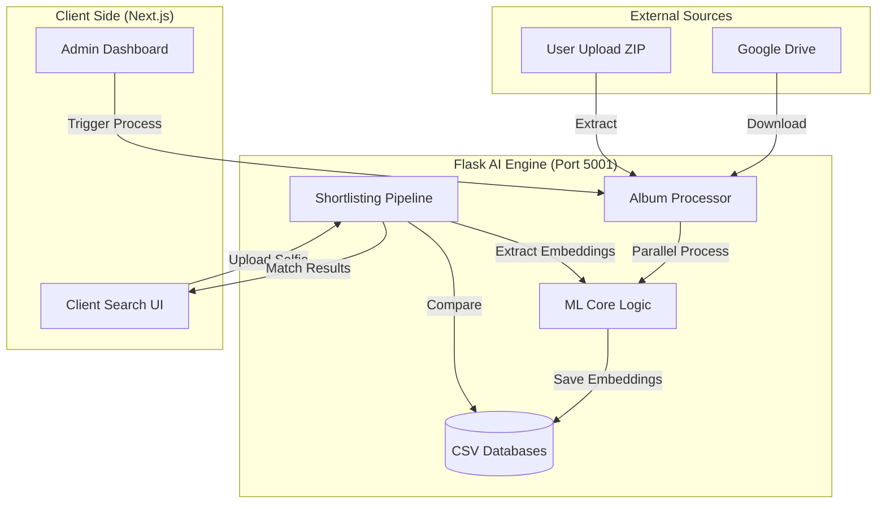

# 📸 Face Recognition Engine: Technical Flow Report

This document provides a comprehensive overview of the Machine Learning, Preprocessing, and Face Recognition architecture used in the **SS Photo & Films** project.

---

## 🏗️ 1. High-Level Architecture Diagram

---

## 🧠 2. ML Core & Preprocessing Flow

The `ml_core.py` module handles the heavy lifting of image analysis and face encoding.

### 🔍 Preprocessing Pipeline
To achieve high accuracy in group photos and various lighting conditions, the engine follows these steps:
1.  **Orientation Correction**: Uses EXIF data to rotate images correctly.
2.  **Adaptive Resizing**: Scales images to a maximum of **2048px** (LANCZOS) to preserve details in large group shots while managing memory.
3.  **High-Precision Enhancement (CLAHE)**: 
    *   Applies *Contrast Limited Adaptive Histogram Equalization* via OpenCV.
    *   Enhances local contrast around eyes, nose, and mouth to create more distinct 128D embeddings.
4.  **Multi-Stage Detection**:
    *   **Standard Scan**: `upsample=1`.
    *   **Deep Scan**: If no faces are found, it escalates to `upsample=2` to find small or distant faces.

### 🔢 Embedding Generation
*   **Engine**: Built on `dlib` via the `face_recognition` library.
*   **Precision**: Uses `num_jitters=5` during encoding, which calculates the average embedding of 5 slightly different versions of the face for maximum stability.
*   **Filtering**: Automatically ignores "noise" (detections smaller than 8x8 pixels).

---

## 📁 3. Owner Workflow (Album Processing)

Managed by `album_processor.py`, this pipeline builds the searchable database for an event.

### 🚀 Key Functionalities
*   **Multi-Source Sync**: Supports Google Drive (folder or file) and direct archive uploads.
*   **Resilient Extraction**: Uses `patoolib` to handle `.zip`, `.rar`, and `.war` formats.
*   **Parallel Execution**: Utilizes a `ProcessPoolExecutor` with **N-1 CPU cores** to process thousands of images efficiently.
*   **Watchdog System**: Implements a **45-second timeout** per image to prevent the engine from hanging on corrupted files.
*   **Live Progress**: Sends real-time status updates via webhooks to the Next.js frontend.

---

## 🔍 4. User Workflow (Face Matching)

Managed by `shortlisting_pipeline.py`, this is how users find their photos.

### ⚡ The "Selfie Mirror" Solution
Selfies are often mirrored by phone cameras. The engine solves this by:
1.  Extracting embeddings from the **original** selfie.
2.  Extracting embeddings from a **horizontally flipped** version.
3.  Comparing both vectors against the database to ensure a match regardless of mirror orientation.

### 🎯 Match Logic
*   **Algorithm**: Euclidean Distance (L2 Norm).
*   **Threshold**: `MATCH_THRESHOLD = 0.40` (optimized for accuracy vs. recall).
*   **Sorting**: Results are sorted by confidence (lowest distance first), ensuring the user sees their best matches at the top.

---

## 📡 5. Important API Endpoints

| Endpoint | Method | Description |
| :--- | :--- | :--- |
| `/api/owner/process_album` | `POST` | Triggers background album scanning (Admin). |
| `/api/job-status/<id>` | `GET` | Returns live progress (total/processed/failed/stage). |
| `/api/v1/shortlist` | `POST` | Receives user selfie and returns matching filenames. |
| `/serve_image/<id>/<path>` | `GET` | Optimized image server with deep-search fallback. |
| `/api/health` | `GET` | Engine status and connectivity check. |

---

## 🛠️ 6. Core Dependencies
*   `face_recognition`: The 128D vector generation engine.
*   `opencv-python`: For CLAHE and LAB color space processing.
*   `pandas`: For managing and searching the embedding databases.
*   `gdown`: For high-speed Google Drive integration.
*   `flask`: The REST API layer.

---
> [!TIP]
> **Performance Tip**: The engine is optimized for group photos. If accuracy drops, consider reducing the `MATCH_THRESHOLD` to `0.35` for stricter matches.
